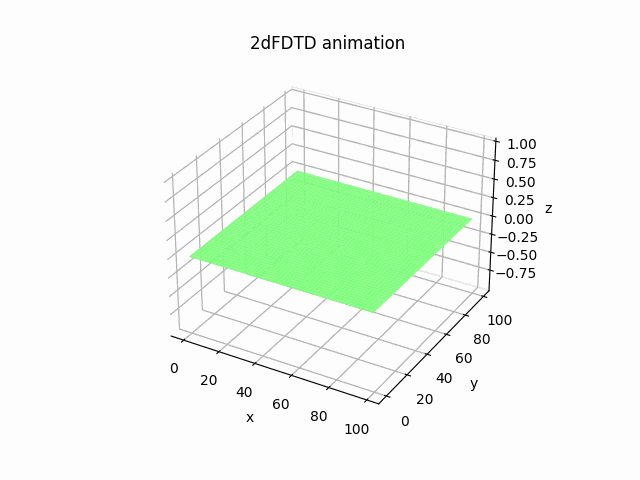

# 2022鈴木ゼミナール FDTD法による電磁界解析

## 1. 概要
FDTD法を用いた電磁界解析とアンテナ解析

## 2. 環境
- 使用言語：C, Python
- 開発環境：vscode

## 3. システム構成
以下システム構成図である.  
省略

## 4. 内容
機能一覧
- a
- b
- c

## 5．今後の計画

## 6．参考文献
時間があるときにまとめます...

## 6．その他
